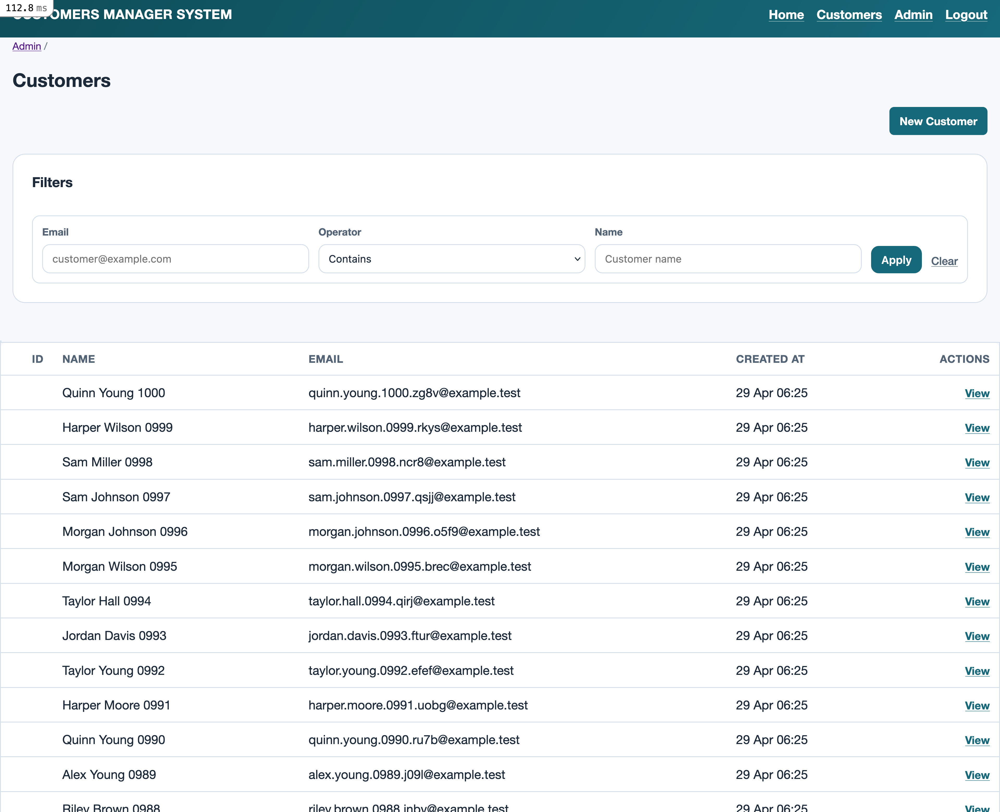
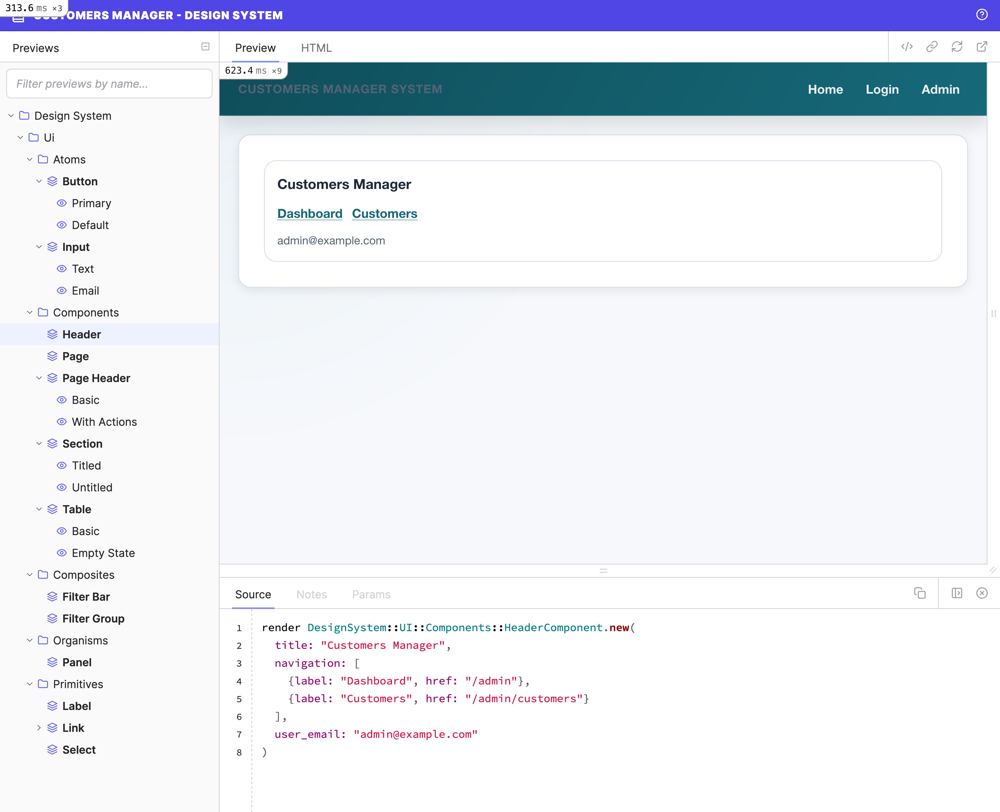

# Customers Manager System

Admin platform for customer management with an ActiveAdmin runtime and a ViewComponent-based Design System.

## Screenshots

### Customers Dashboard (ActiveAdmin Runtime)

### Design System Dashboard (Lookbook)

## Notes

- Screenshots are stored under `docs/assets/screenshots/`.
- The Customers index UI uses the Design System inside ActiveAdmin (`/admin/customers`).
- Development seeds can generate fake customer data (`SEED_CUSTOMERS_COUNT`, default `100`).
